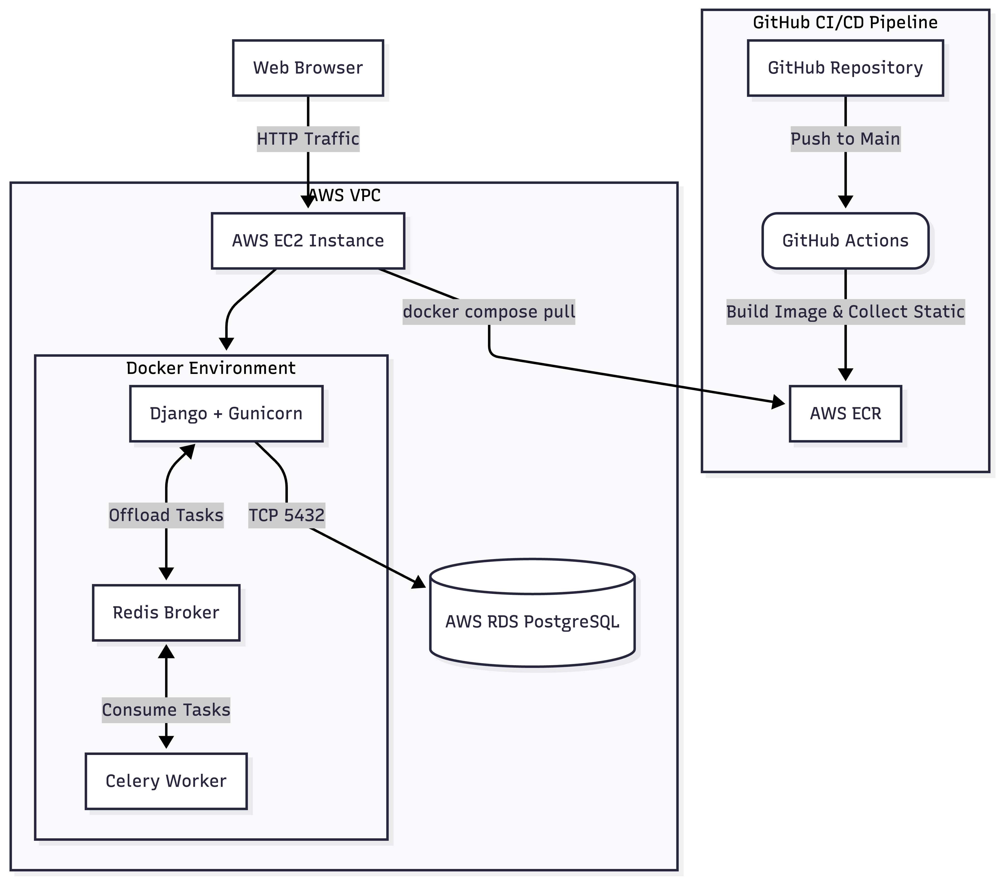

# LogiTrack


LogiTrack is a production-ready, highly available logistics management platform. Designed with a cloud-native mindset, it allows administrators to track shipments, orchestrate delivery routes, and manage logistics operations at scale.

This repository serves as a showcase of modern **DevOps, CI/CD, and Cloud Architecture** principles, featuring a completely decoupled, stateless containerised deployment on Amazon Web Services (AWS).

---

## Cloud Architecture & Infrastructure

The infrastructure of LogiTrack was deliberately designed to separate compute, data, and background processing into distinct, secure layers. 

### Architecture Diagram



### Components

* **Compute Layer (AWS EC2):** This application runs on a lightweight AWS EC2 instance (cost-efficient cloud computer). The EC2 server acts as a task runner, which follows instructions, holds no source code, and performs no build. It simply pulls the immutable (ready-to-run)Docker image from ECR and executes it. Memory optimisation (like 2GB swap file) is configured to ensure stable execution of Gunicorn, Celery and Redis.


* **Data Layer (AWS RDS):** To keep the application reliable, all important data, including users, tracking logs, and shipments is stored in AWS RDS, which is Amazon's managed database service. This means even if the containers are stopped or restarted, no data is ever lost.
* **Task Queueing (Celery & Redis):** When the application needs to perform time-consuming tasks like sending emails, these are handed off to a background worker (Celery) rather than making the user wait. Redis acts as the middleman that passes these tasks across, keeping the website fast and responsive for everyone.
* **Static Asset Management (WhiteNoise):** Instead of relying on an external S3 bucket, which introduces network latency and CI/CD IAM complexities, static files are handled by WhiteNoise. CSS and JS assets are compiled directly into the Docker image during the build phase and served autonomously.

---

## CI/CD & Deployment Strategy

All building and packaging of the application happens on GitHub's servers before anything reaches the live site. The production server only ever receives a finished, ready-to-run package, and it never compiles or modifies code itself.


1. **Local Development:** Code changes are made and tested locally using `docker compose up --build`.
2. **Automated Pipeline (GitHub Actions):** Pushing to the `devops-pipeline` branch automatically triggers the CI/CD pipeline. GitHub's runner automatically builds the Docker image, runs the `collectstatic` protocol, and securely pushes the finalised container to **AWS Elastic Container Registry (ECR)**.
3. **Production Pull:** The live server is then instructed to download the latest version of the application from ECR. The old version is safely shut down first, and the new version takes over with no downtime for the end user.

---

## Security & Networking

Industry-standard security measures were put in place across the entire cloud environment:
* **Zero-Trust Database:** The AWS RDS instance is not exposed to the public internet. Its VPC Security Group explicitly allows inbound PostgreSQL traffic (Port 5432) *only* from the specific Security Group attached to the EC2 instance.

* **Secure Environment Variables:** Sensitive information such as passwords and database credentials are stored in a private file that is never uploaded to GitHub. This file is only loaded when the application starts up on the live server.
* **Vulnerability Minimisation:** The Docker file is built on top of python3.12-slim, massively reducing the attack surface by excluding unnecessary OS-level packages.


---

## Production Deployment Workflow

This project utilises an immutable deployment strategy. **Do not build images directly on the production EC2 server.**

1. **Develop locally:** Make your code or CSS changes in your local environment.
2. **Push to GitHub:** Commit and push your changes to the `main` branch.
   ```bash
   git add .
   git commit -m "Describe your feature here"
   git push origin devops-pipeline
   ```
3. **Wait for CI/CD:** GitHub Actions will automatically build the image, run `collectstatic`, and push the finished artefact to AWS ECR.
4. **Automated Deployment:** You do not need to manually connect to the server at any point. The pipeline automatically pulls the latest image and recreates the containers as defined in the `docker-compose.yml` file.


---

## Local Developer Setup

To replicate this environment locally, ensure you have [Docker](https://www.docker.com/) and [Docker Compose](https://docs.docker.com/compose/) installed.

### 1. Clone & Configure
```bash
git clone https://github.com/emmanuelal99/swe_devops.git
cd swe_devops
git checkout -b devops-pipeline
git push origin devops-pipeline
```
Create a `.env` file in the root directory:
```env
SECRET_KEY=your-local-dev-secret-key
DEBUG=True
CSRF_TRUSTED_ORIGINS=http://localhost,http://127.0.0.1

# Docker-based PostgreSQL
DB_HOST=db
DB_NAME=logitrack_db
DB_USER=postgres
DB_PASSWORD=yourpassword
DB_PORT=5432
```

### 2. Build and Execute
```bash
docker compose up -d --build
```

### 3. Initialize the Database
```bash
docker compose exec web python manage.py migrate
docker compose exec web python manage.py createsuperuser
```

Navigate to `http://localhost:8000` to view the application, or `http://localhost:8000/admin` to access the logistics dashboard.

---

## Engineering Challenges Overcome

* **Memory Exhaustion (SIGKILL):** Early deployments ran out of memory on the server, causing the background worker and message broker to be forcefully shut down. This was resolved by configuring a swap file, which is a reserved section of the hard drive that acts as extra memory when the server is running low — stabilising the application without needing to upgrade to a more expensive server.
* **CI/CD Static File Deadlocks:** Early pipeline builds were failing ( `403 Forbidden` errors) due to a permissions error when trying to connect to Amazon S3. After reviewing the application, it became clear that S3 was unnecessary since the app does not handle any user file uploads. S3 was removed entirely and replaced with WhiteNoise, which simplified the setup, fixed the pipeline, and reduced the number of external services the application depends on.
* **VPC Networking Timeouts:** The initial database setup froze and never completed. After investigating the error logs, it was found that the server's firewall was blocking the connection between the application and the database. This was fixed by updating the AWS Security Group rules to allow the EC2 server to communicate with the RDS database on the correct port.

---
*Developed as a demonstration of robust Cloud Architecture, Containerization, and DevOps methodologies.*
